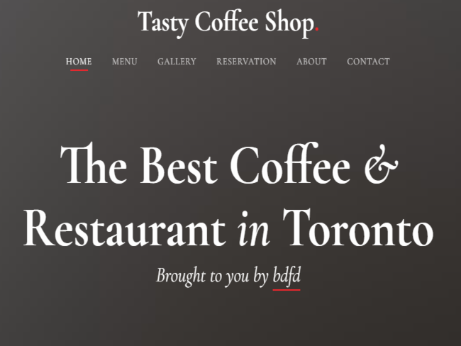

# </a>Website for GetRekt110 Team

    

## About This Portfolio/Project Details

## Project Details

The Project Page enlisted as follows:

- [x] **P1- Home Page**
- [x] **P2-Team Page**
- [x] **P4-Project Page**
- [x] **P5-Blog Page**
- [x] **P6-Contact Page**

## Project Description:

 
Description: Here you can add more detail information about this project and describe it in the documentation for more details.

## Tools Used In This Project

**Tools:** GitHub, Visual Studio Code Editor

**Libraries:** HTML, CSS, and JavaScript

### Thanks For Watch This Repositories!

### <i>KEEP AWESOME & STAY COOL!</i>

### Feel Free To Fork And Report If You Find Any Issue :)

